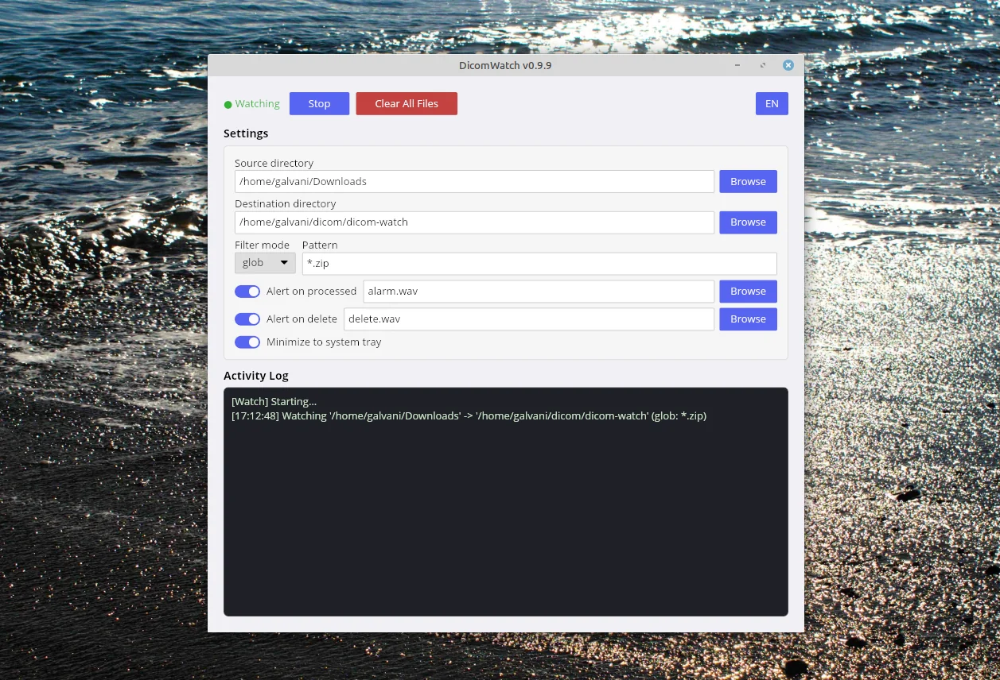

# DicomWatch

A cross-platform desktop app that watches a directory for new zip files, extracts them,
and notifies you — so you focus on reading studies, not managing files.

Supports Linux (X11/Wayland) and Windows 10/11.



## What it is

DicomWatch monitors a source directory for incoming zip archives (DICOM studies),
auto-extracts them to a destination folder, deletes the original archive, and
plays a notification sound.

Built with Iced for a native GTK-like GUI on X11 and Wayland. Single binary,
no runtime dependencies beyond what your Linux desktop already has.

Minimizes to the system tray — close the window and it keeps watching.
Right-click the tray icon to restore, toggle, delete all, or quit.
Enable with `tray.enabled = true` in `config.toml`.

## Install

### Linux

1. Download the latest `dicom-watch-v*-linux-x86_64.zip` from the [releases page](../../releases).
2. Extract to a directory:
   ```bash
   unzip dicom-watch-v0.8.0-linux-x86_64.zip -d ~/dicom-watch
   cd ~/dicom-watch
   ```
3. (Optional) Install to application menu:
   ```bash
   ./install.sh
   ```
4. Copy the example config and edit:
   ```bash
   cp config.toml.example config.toml
   nano config.toml
   ```
5. Run:
   ```bash
   ./dicom-watch
   ```

### Windows

1. Download the latest `dicom-watch-v*-windows-x86_64.zip` from the [releases page](../../releases).
2. Extract to a folder (e.g. `C:\DicomWatch`).
3. Copy `config.toml.example` to `config.toml` and edit paths in Notepad.
4. Double-click `dicom-watch.exe` or create a desktop shortcut:
   right-click the `.exe` → **Send to** → **Desktop (create shortcut)**.

## Usage

```bash
./dicom-watch                          # start the GUI
cargo run                              # debug build + run
cargo build --release                  # optimized binary at target/release/
cargo test                             # run tests
cargo fmt --check && cargo clippy      # lint check
```

### Typical workflow

1. Drop a `.zip` file in your source directory (e.g. `~/Downloads`).
2. DicomWatch detects it, extracts contents, removes the zip, plays a sound.
3. Open the extracted DICOMs in [Weasis](https://nroduit.github.io/).
4. Click **Delete All** to clean the destination folder when done.

## Configuration

`config.toml` lives next to the binary. See [`config.toml.example`](config.toml.example)
for a documented template.

```toml
[directories]
source = "/home/user/Downloads"
destination = "/home/user/dicom/studies"

[filter]
mode = "glob"          # or "regex"
pattern = "*.zip"

[sound]
enabled = true
file = "/home/user/sounds/notification.ogg"
```

Validation errors at startup are explicit — missing directories, invalid regex,
sound file not found — pointing to the exact field to fix.

For regex mode, see [`docs/regex-guide.md`](docs/regex-guide.md).

## Build from source

```bash
# System dependencies (Debian/Ubuntu)
sudo apt install libx11-dev libwayland-dev libxkbcommon-dev

# Build
cargo build --release
# Binary: target/release/dicom-watch (Linux) or target/release/dicom-watch.exe (Windows)
```

Windows builds also require the [MSVC toolchain](https://visualstudio.microsoft.com/visual-cpp-build-tools/)
or [mingw-w64](https://www.mingw-w64.org/).

## License

MIT
